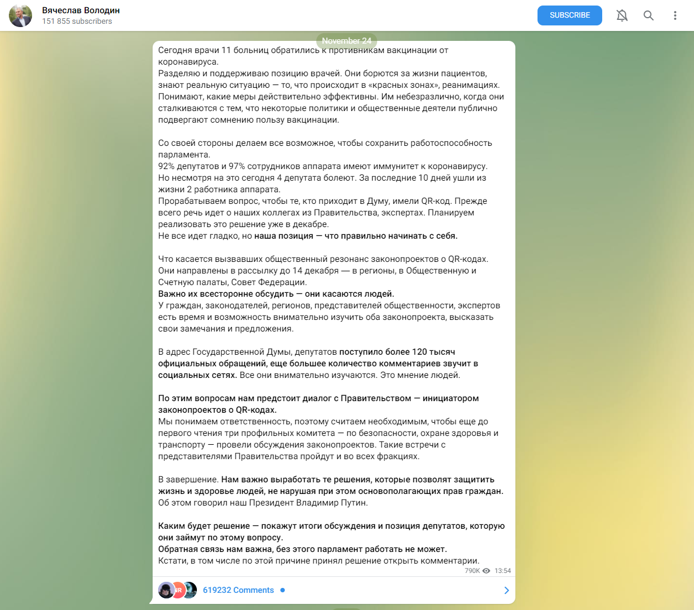

# Telegram scraper

## Context
Retrieve all comments on the post of the russian Duma's President VV Volodine :

## Requirements
- python >3.8
- a valid Telegram API Key see the [instructions](https://core.telegram.org/api/obtaining_api_id).
using the [telethon](https://github.com/LonamiWebs/Telethone) package.

## Usage
- set the proper values in the *config.py* file
- create a new python env and activate it
- install the requirements.txt
- run `python main.py`

## Output
- the raw json files are stored in the `/data` folder
- you get the all data for the field ["date", "user_id" "text"] as both a `.csv`  and an `.xlsx` file.

